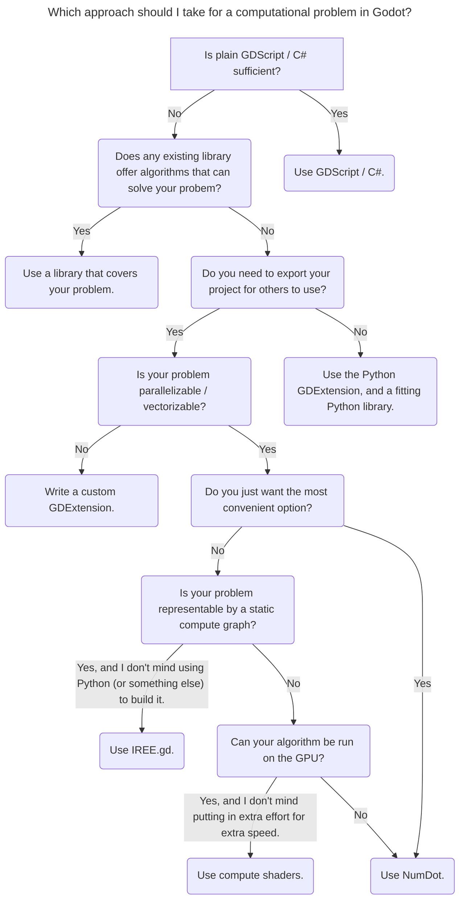

# Awesome Godot Scientific / Computation
A curated list of [free](https://www.gnu.org/philosophy/free-sw.html) add-ons and scripts for Godot, but specifically for hyperoptimized computation and scientific methodology.

You can find a general list for free Godot stuff in Godot's own [Awesome Godot](https://github.com/godotengine/awesome-godot).

If you find this interesting, you may want to join our Godot Scientific Discord: [https://discord.gg/mwS2sW6V5M](https://discord.gg/mwS2sW6V5M).

### What is scientific software?

For the sake of this repository, scientific software is software that is commonly used by scientists to achieve their goals. You may have heard of software such as [NumPy](https://numpy.org), [tensorflow](https://www.tensorflow.org) and [MatLab](https://www.mathworks.com/products/matlab.html). These are the kinds of things we are talking about.

### What is hyperoptimized computation?

General-purpose programming is very useful. But when you have large amounts of data, your program can start to slow down a lot. This is because general purpose programming can waste a lot of CPU cycles for duplicated or unnecessary logic.

To solve this issue, many smart people have optimized common operations, such as addition, matrix multiplications, or even convolutions. This comes in many forms, but often involves hyperoptimized CPU or GPU instructions such as [SIMD](https://en.wikipedia.org/wiki/Single_instruction,_multiple_data) or [CUDA](https://developer.nvidia.com/cuda-zone#:~:text=CUDA®%20is%20a%20parallel,harnessing%20the%20power%20of%20GPUs.). If you want your code to be fast, you can use these implementations to speed it up.

### I need help deciding how to implement my algorithm!

If you have a computation task, and you aren't sure where to start with optimization, this flowchart may help you decide on a particular strategy to use. The flowchart will suggest you the option that involves the least amount of effort, depending on your use-case. Keep in mind it makes a _recommendation_, and should not be regarded an authority as to which library actually fits your use-case best.

## Contents

### Add-Ons (a-z)

- [GDMP](https://github.com/j20001970/GDMP): Running machine learning learning models in Godot, with [MediaPipe](https://ai.google.dev/edge/mediapipe/solutions/guide).
- [Godot Python Extension](https://github.com/maiself/godot-python-extension): Write your Godot scripts and classes in Python.
- [IREE.gd](https://github.com/iree-gd/iree.gd): Running machine learning models in Godot, with [IREE](https://iree.dev).
- [NumDot](https://numdot.readthedocs.io/en/latest/index.html): NumPy-like tensor math and scientific computation for Godot, using [xtensor](https://xtensor.readthedocs.io/en/latest/).
- [OpenCV for Godot](https://github.com/matt-s-clark/godot-gdextension-opencv): Bringing computer vision to Godot, with [OpenCV](https://opencv.org).

### Scripts (a-z)

_None yet._

### Tutorials and Guides (a-z)

- [NumDot Tutorials](https://numdot.readthedocs.io/en/latest/how-to-use/getting_started.html) are available as part of its [documentation](https://numdot.readthedocs.io/en/latest/index.html).

### Other

- Ongoing community poll: [Godot Science and Computation Survey / 2024](https://forms.gle/PVyRcQZpifjMxdKB8)
    - [View the current results here](https://docs.google.com/forms/d/11UK1JR_MxvxokblTPuejdHk04WufhyrPwfnInPcvisA/viewanalytics).
